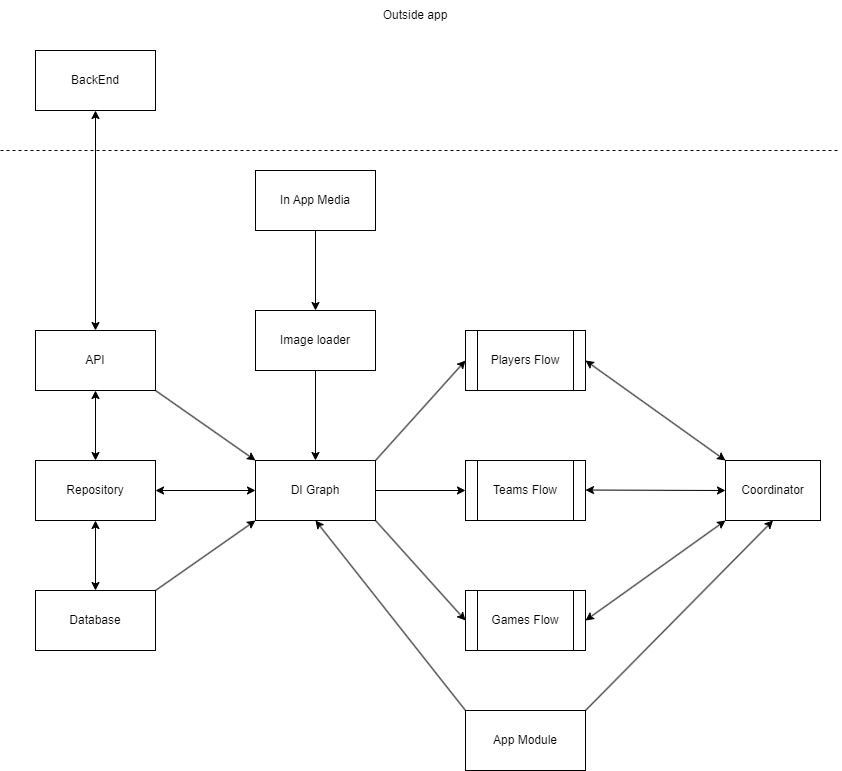
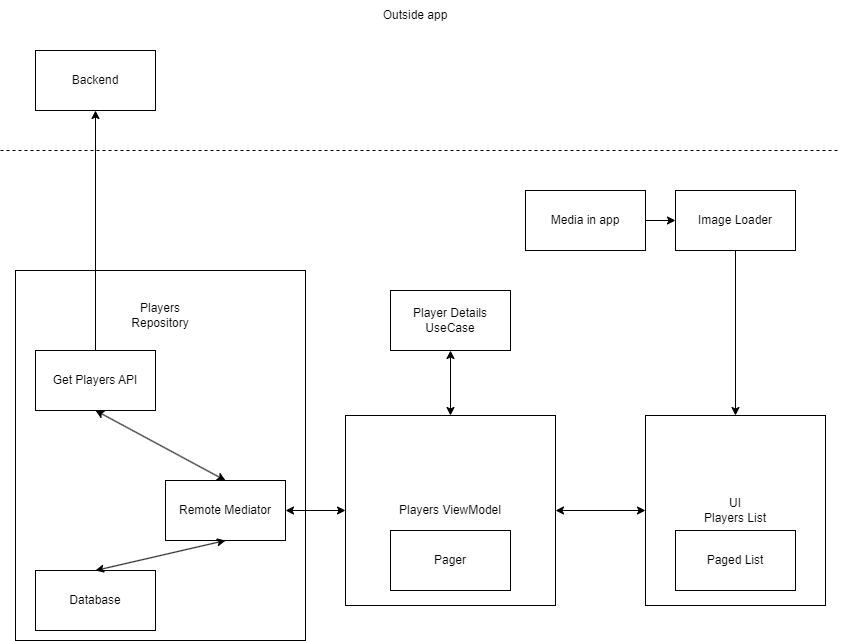

# System Design
## Requirements
Below is a list of requirements that I have decided is most important for the NBA Stats App so far.

1. Ability to see list of players, and team they come from
2. Ability to search for specific players
3. Ability to see details of a specific player, like position, weight and height
4. Ability to see all the teams
5. Ability to see specific details of the team, like city they belong in and what players do they have. 
6. Ability to see past NBA games
7. Ability to compare stats between different players

## Technical Requirements

Below is technical requirements that are fue to some limitations from either the app or api standpoint. 

- Due to limitations of api only having max 100 players for each call, we need to implement pagination in the app. Pagination works with database, so if we run out of players in the database, we will call api for more. Also there is refresh data logic, to update plyaer info after a day to make sure everything is up to date. 
- This is another limitation. There is no ability to get all players belonging to a team form single api call. Thus on team page, you will only show players that are in app database.
- Since we are using an open api, we will not concern ourselves too much about api security like authorization. Also not saving any important personal info in the app. 

## Entities
### Player

```
Player:
    id: int
    first_name: string
    last_name: string
    position: string
    height_feet: int
    height_inches: int
    weight_pounds: int
    team_name: string

```
### Team

```
Team:
    id: int
    abbreviation: string
    city: string
    conference: string
    division: string
    full_name: string
    name: string

```

### Game

```
Game:
    id: int
    date: string
    home_team_score: int
    visitor_team_score: int
    season: int
    period: int
    status: string
    time: string
    postseason: bool
    home_team_name: string
    away_team_name: string

```

## APIs

All the APIs come from from the [Ball Dont Lie Website](https://app.balldontlie.io/). Below will have the important ones used in the app. All of the apis so far in the app, will be using REST.

### Get All Players
```
GET https://www.balldontlie.io/api/v1/players return List of Player

Query Params:
    page: int - Default:0
    per_page: int - Default:25
    search: string
```

### Get All Teams
```
GET https://www.balldontlie.io/api/v1/teams return List of Team

Query Params:
    page: int - Default:0
    per_page: int - Default:30
```

### Get All Games
```
GET https://www.balldontlie.io/api/v1/games return List of Game

Query Params:
    page: int - Default:0
    per_page: int - Default:30,
    dates: Array of dates
    seasons: Array of seasons
    team_ids: Array of int
    postseason: bool
    start_date: string
    end_date: string
```

## High Level Design



- API Service <br />
Abstracts client-server communications from the rest of the system.
- Database <br />
A single source of truth. The data your system receives gets persisted on the disk first and then propagated to other components.
- Repository <br />
A mediator component between API Service and Persistence.
- Get Players Flow <br />
Represents a set of components responsible for displaying an infinite scrollable list of players.
- Get Teams Flow <br />
Represents a set of components responsible for displaying all the teams.
- Get Games Flow <br />
Represents a set of components responsible for displaying an infinite scrollable list of games.
- DI Graph <br />
Dependency injection graph. Using Hilt, but can use alternatives like Koin.
- Image Loader <br />
Responsible for loading and caching static images. Usually represented by a 3rd-party library.
- Coordinator <br />
Organizes flow logic between Tweet Feed and Tweet Details components. Helps decoupling components of the system from each other.
- App Module <br />
An executable part of the system which "glues" components together.

## Architecure of Modules

### Diagram of getting player list



## Pagination

Pagination in the app works buy using Offset Page pagination. We give the api both a limit and page offset, and get list of players by increasing the offset wehen needed. 